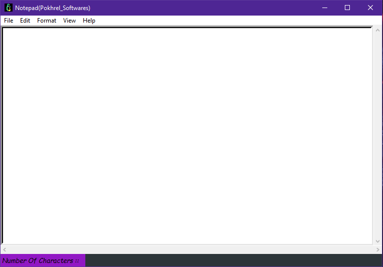
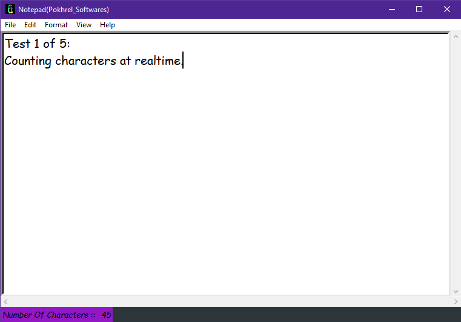
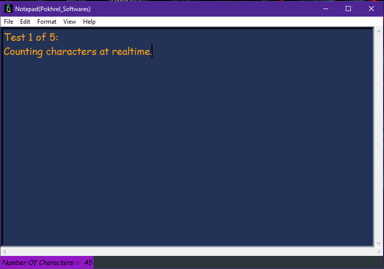

# Notepad-using-python

NOTE :: The Code is not Fully optimize, as it was a project just for fun, there may be some irrevalent and unused variables.

A Notepad Application created entirely on Python, using Tkinter module for GUI 

Required Modules and sub-modules for the .py file to Run::

from tkinter import *
from PIL import ImageTk,Image
import tkinter.messagebox as tmsg
import tkinter.filedialog as fldg
import os
import threading
import tkinter.font as tkFont

1) Normal UI

2) Counting Character

3) Theme Change

